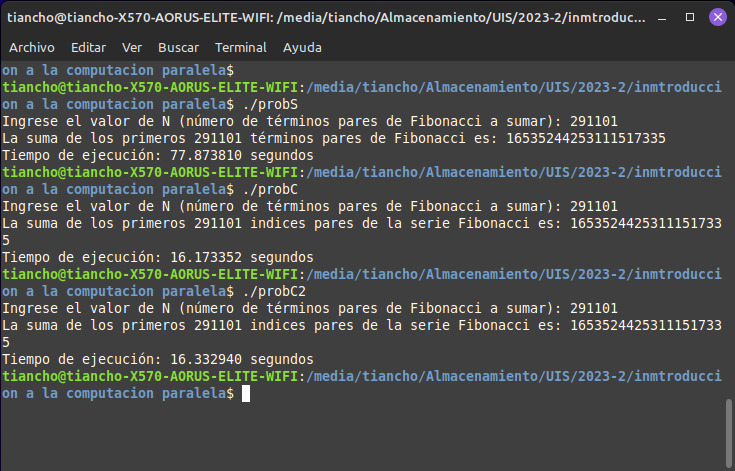

# Calculo de la suma de nos N índices pares que solicite el usuario


Dentro de la solución de esta actividad se encuentran 3 algoritmos, uno de ellos con la solución al problema usando la lógica secuencial, los otros dos usan la paralelización brindada por openMP.


El problema está basado en la serie de Fibonacci, el cual es la suma de los dos números anteriores, siendo 0 y 1 los dos primeros números de la sucesión. De esta forma el primer índice número 1 es el número 0, el segundo el número 1 y así sucesivamente. Se nos pide que el usuario ingrese un número N el cual es el número de los índices primos que desea sumar

## Como se trabaja con openMP

- Debemos tener instalada la tecnología de paralelización de openMP en nuestra maquina
```sh
sudo apt-get install libomp-dev
```
- Compilador de C/C++, como lo es GCC, puede comprobar si lo tiene ejecutando:
```sh
gcc --version
```
- Usar la sintaxis de openMP dentro de nuentro codigo
- Compilar el archivo .c, por ejemplo:
```sh
gcc -fopenmp Problema_A_conOMP.c -o probC
```
- Ejecutar el archivo compilado
```sh
./probC
```

## Resultados 

Para que la prueba arroje resultados visibles se hace uso de un N grande, para este caso el número 291101.
De este experimento es posible apreciar los beneficios de paralelizar, ya que el tiempo de ejecución paso de ms de 1 minuto a menos de 20 segundos 


